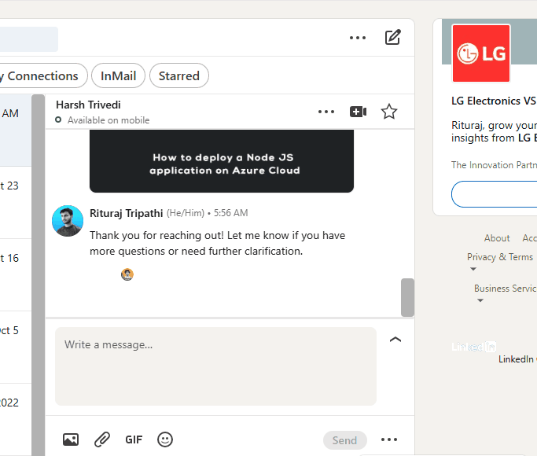

## Overview

**AI-Reply-LinkedIn** is a Chrome extension that enables users to reply on LinkedIn using predefined prompts. It simplifies the process of responding to messages or comments on LinkedIn by offering AI-powered suggestions that can be used as replies, saving time and increasing productivity.

## Features

- **Predefined Prompts:** Quickly respond to LinkedIn messages or comments using predefined prompts.
- **Time-saving:** No need to type repetitive responses; simply choose from a list of suggestions.
- **Customizable Responses:** Easily customize the predefined replies to better fit your communication style.
- **Easy Installation and Setup:** Install the extension in your Chrome browser and start replying instantly.

## Installation

1. Clone the repository:
    ```bash
    git clone https://github.com/riturajtripathi139/AI-Reply-LinkedIn.git
    ```

2. Navigate to the project directory:
    ```bash
    cd AI-Reply-LinkedIn
    ```

3. Load the extension in Chrome:
    - Open Chrome and navigate to `chrome://extensions/`.
    - Enable **Developer mode** in the top right corner.
    - Click on **Load unpacked** and select the project directory.

4. The extension will now be active in your browser.

## Usage

1. Open LinkedIn and navigate to any conversation or comment section.
2. Click on the AI-Reply-LinkedIn extension icon in the browser toolbar.
3. Choose a predefined reply from the available options or customize your response.
4. Click **Send** to reply instantly.

## Contributing

Contributions are welcome! To contribute:

1. Fork the repository.
2. Create a new branch for your feature or bug fix:
    ```bash
    git checkout -b feature-name
    ```
3. Commit your changes:
    ```bash
    git commit -m "Added new feature"
    ```
4. Push to the branch:
    ```bash
    git push origin feature-name
    ```
5. Open a Pull Request.

6. ## Demo Video

   
